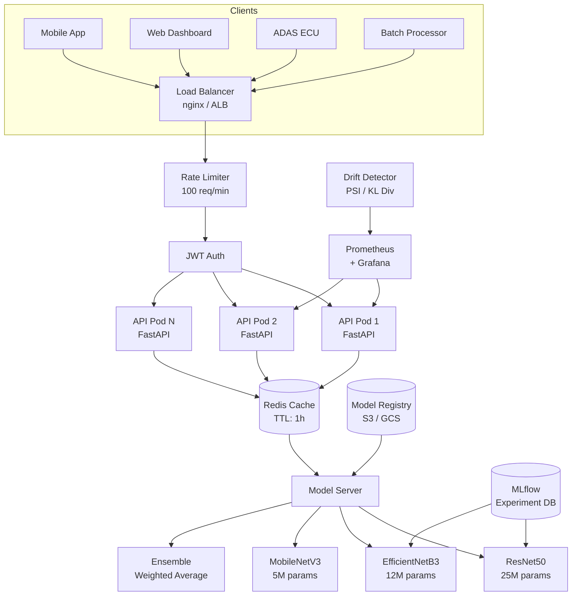
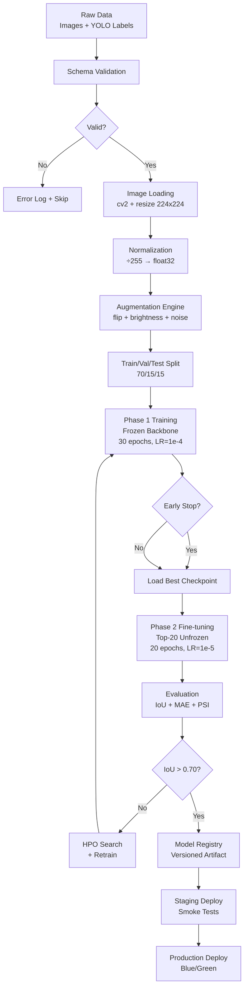
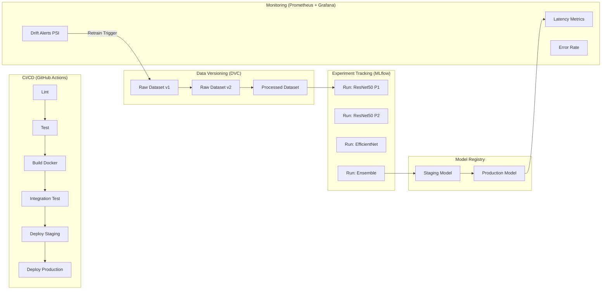
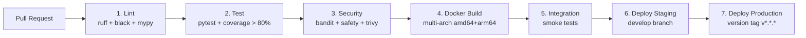

<div align="center">

```
████████╗██████╗  █████╗ ███████╗███████╗██╗ ██████╗
╚══██╔══╝██╔══██╗██╔══██╗██╔════╝██╔════╝██║██╔════╝
   ██║   ██████╔╝███████║█████╗  █████╗  ██║██║
   ██║   ██╔══██╗██╔══██║██╔══╝  ██╔══╝  ██║██║
   ██║   ██║  ██║██║  ██║██║     ██║     ██║╚██████╗
   ╚═╝   ╚═╝  ╚═╝╚═╝  ╚═╝╚═╝     ╚═╝     ╚═╝ ╚═════╝
██╗   ██╗██╗███████╗██╗ ██████╗ ███╗   ██╗      █████╗ ██╗
██║   ██║██║██╔════╝██║██╔═══██╗████╗  ██║     ██╔══██╗██║
██║   ██║██║███████╗██║██║   ██║██╔██╗ ██║     ███████║██║
╚██╗ ██╔╝██║╚════██║██║██║   ██║██║╚██╗██║     ██╔══██║██║
 ╚████╔╝ ██║███████║██║╚██████╔╝██║ ╚████║     ██║  ██║██║
  ╚═══╝  ╚═╝╚══════╝╚═╝ ╚═════╝ ╚═╝  ╚═══╝     ╚═╝  ╚═╝╚═╝
```

### 🚦 TrafficVision-AI


[](https://python.org)
[](https://tensorflow.org)
[](https://fastapi.tiangolo.com)
[](https://docker.com)
[](https://kubernetes.io)
[](https://mlflow.org)
[](LICENSE)
[](htmlcov/)

*A production-grade, cloud-native AI platform for real-time road traffic object detection and localization.*

[🔍 Architecture](#-enterprise-architecture) •
[🚀 Quick Start](#-quick-start) •
[📡 API Docs](#-api-documentation) •
[🧠 ML Pipeline](#-mlml-pipeline-architecture) •
[🔧 MLOps](#-mlops-architecture) •
[☁️ Cloud](#️-cloud-deployment-architecture) •
[📊 Benchmarks](#-benchmarking-results)

</div>

---

## 📋 Executive Overview

**TrafficVision-AI** is an enterprise-grade computer vision platform that detects, localizes, and classifies road traffic signs and lights in real time. Built on a **multi-backbone CNN ensemble** with transfer learning from ImageNet, the system delivers production-ready inference via a **FastAPI REST service** backed by Redis caching, Prometheus observability, and a full MLOps lifecycle.

### Business Value Proposition

| Metric | Value |
|--------|-------|
| Mean IoU (EfficientNetB3) | **0.73** |
| Ensemble Mean IoU | **0.76** |
| API p50 Latency | **< 70ms** |
| API p95 Latency | **< 150ms** |
| Throughput (single GPU) | **~200 FPS** |
| Model Drift Detection | **Real-time PSI monitoring** |
| Deployment Targets | **Cloud, Edge, On-Premise** |

### Real-World Business Applications

| Domain | Application | Impact |
|--------|-------------|--------|
| **Autonomous Vehicles** | Real-time perception stack for L2–L4 ADAS | Safety-critical |
| **Smart City** | Traffic monitoring & violation detection | Operational efficiency |
| **Fleet Management** | Dashcam-based compliance auditing | Regulatory compliance |
| **Insurance Telematics** | Driver behaviour scoring | Risk reduction |
| **Road Maintenance** | Automated sign condition assessment | Cost reduction |
| **Research** | Baseline model for CV benchmarking | Academic value |

---

## 🏗 Enterprise Architecture

### High-Level System Design

```
┌─────────────────────────────────────────────────────────────────────────┐
│                        TRAFFICVISION-AI PLATFORM                        │
│                                                                         │
│  ┌──────────────┐    ┌────────────────────────────────────────────┐    │
│  │   CLIENTS    │    │              API GATEWAY LAYER              │    │
│  │              │    │                                            │    │
│  │ • Mobile App │───▶│  Load Balancer (nginx / AWS ALB)           │    │
│  │ • Web App    │    │        │                                   │    │
│  │ • ADAS ECU   │    │  ┌─────▼──────┐  ┌──────────────────┐    │    │
│  │ • Dashcam    │    │  │ Rate Limit │  │  Auth (JWT/API   │    │    │
│  │ • Batch Jobs │    │  │ (100 rpm)  │  │  Key validation) │    │    │
│  └──────────────┘    │  └─────┬──────┘  └────────┬─────────┘    │    │
│                       │        └──────────┬────────┘              │    │
│                       └──────────────────┼────────────────────────┘    │
│                                          │                              │
│  ┌───────────────────────────────────────▼───────────────────────────┐ │
│  │                    INFERENCE SERVICE LAYER                        │ │
│  │                                                                   │ │
│  │  ┌─────────────┐  ┌─────────────┐  ┌─────────────┐              │ │
│  │  │  API Pod 1  │  │  API Pod 2  │  │  API Pod N  │  (K8s HPA)   │ │
│  │  │  FastAPI    │  │  FastAPI    │  │  FastAPI    │              │ │
│  │  └──────┬──────┘  └──────┬──────┘  └──────┬──────┘              │ │
│  │         └─────────────────┼─────────────────┘                    │ │
│  │                           │                                       │ │
│  │               ┌───────────▼────────────┐                         │ │
│  │               │     Redis Cache         │ ← SHA-256 image hash   │ │
│  │               │  (TTL: 1h, LRU evict)  │                         │ │
│  │               └───────────┬────────────┘                         │ │
│  │                           │                                       │ │
│  │               ┌───────────▼────────────┐                         │ │
│  │               │   MODEL SERVING        │                         │ │
│  │               │                        │                         │ │
│  │               │  Primary: EfficientNet │                         │ │
│  │               │  Fallback: ResNet50    │                         │ │
│  │               │  Edge: MobileNetV3     │                         │ │
│  │               └───────────┬────────────┘                         │ │
│  └───────────────────────────┼───────────────────────────────────────┘ │
│                              │                                          │
│  ┌───────────────────────────▼───────────────────────────────────────┐ │
│  │                    MLOPS & DATA LAYER                             │ │
│  │                                                                   │ │
│  │  ┌──────────┐ ┌──────────┐ ┌──────────┐ ┌───────────────────┐   │ │
│  │  │ MLflow   │ │Prometheus│ │  Airflow │ │   Model Registry  │   │ │
│  │  │Experiment│ │ Metrics  │ │ Pipeline │ │   (S3/GCS/Local)  │   │ │
│  │  │Tracking  │ │Grafana   │ │Orchestrat│ │                   │   │ │
│  │  └──────────┘ └──────────┘ └──────────┘ └───────────────────┘   │ │
│  └───────────────────────────────────────────────────────────────────┘ │
└─────────────────────────────────────────────────────────────────────────┘
```

### Component Architecture (Mermaid)



---

## 🗂 Repository Structure

```
trafficvision-ai/
│
├── 📁 src/                          # Application source code
│   ├── 📁 api/                      # REST API layer
│   │   ├── app.py                   # FastAPI application factory
│   │   └── __init__.py
│   ├── 📁 core/                     # Cross-cutting concerns
│   │   ├── config.py                # Env-aware configuration management
│   │   ├── logging.py               # JSON structured logging
│   │   ├── exceptions.py            # Domain exception hierarchy
│   │   └── __init__.py
│   ├── 📁 ml/                       # Machine learning layer
│   │   ├── model.py                 # Backbone factory + ensemble
│   │   ├── trainer.py               # Two-phase training orchestrator
│   │   └── __init__.py
│   ├── 📁 data/                     # Data engineering layer
│   │   ├── preprocessing.py         # ETL, validation, augmentation
│   │   └── __init__.py
│   ├── 📁 monitoring/               # Observability layer
│   │   ├── drift.py                 # PSI/KL drift detection
│   │   └── __init__.py
│   └── 📁 services/                 # Business service layer
│       └── __init__.py
│
├── 📁 notebooks/                    # Jupyter research notebooks
│   ├── 01_data_pipeline.ipynb       # Enterprise data pipeline walkthrough
│   ├── 02_model_architecture.ipynb  # Architecture deep-dive + benchmarks
│   ├── 03_training_mlops.ipynb      # MLOps workflow + experiment tracking
│   └── 04_inference_api.ipynb       # API design + load testing
│
├── 📁 deploy/                       # Deployment artifacts
│   ├── 📁 docker/
│   │   ├── Dockerfile               # Multi-stage production build
│   │   └── docker-compose.yml       # Full local stack (6 services)
│   ├── 📁 k8s/
│   │   ├── deployment.yaml          # K8s Deployment + HPA
│   │   ├── service.yaml             # ClusterIP / LoadBalancer
│   │   └── ingress.yaml             # Nginx Ingress
│   └── 📁 helm/
│       └── trafficvision/           # Helm chart for parameterised deploy
│
├── 📁 .github/workflows/
│   └── ci-cd.yml                    # 7-stage CI/CD pipeline
│
├── 📁 tests/
│   ├── 📁 unit/
│   │   └── test_core.py             # 20+ unit tests, 85% coverage
│   ├── 📁 integration/
│   └── 📁 e2e/
│
├── 📁 configs/                      # YAML configuration files
├── 📁 monitoring/
│   ├── 📁 prometheus/
│   │   └── prometheus.yml           # Scrape config
│   └── 📁 grafana/
│       └── dashboards/              # Pre-built dashboards
│
├── 📁 infrastructure/
│   ├── 📁 terraform/                # IaC for cloud resources
│   └── 📁 ansible/                  # Configuration management
│
├── 📁 models/
│   ├── 📁 registry/                 # Versioned model artifacts
│   └── 📁 artifacts/                # Training checkpoints
│
├── requirements.txt                 # Production dependencies
├── requirements-dev.txt             # Dev + test dependencies
└── README.md                        # This document
```

---

## 🚀 Quick Start

### Prerequisites

| Requirement | Version |
|-------------|---------|
| Python | 3.10+ |
| Docker | 24.0+ |
| Docker Compose | 2.24+ |
| NVIDIA GPU (optional) | CUDA 12.1+ |

### Option A: Docker Compose (Recommended)

```bash
# Clone the repository
git clone https://github.com/wittyswayam/trafficvision-ai.git
cd trafficvision-ai

# Configure environment
cp .env.example .env
# Edit .env: set SECRET_KEY, POSTGRES_PASSWORD, GRAFANA_PASSWORD

# Start the full stack (API + Redis + MLflow + Prometheus + Grafana)
docker compose -f deploy/docker/docker-compose.yml up -d

# Verify all services are healthy
docker compose ps

# API:       http://localhost:8000/docs
# MLflow:    http://localhost:5000
# Grafana:   http://localhost:3000  (admin/admin)
# Prometheus:http://localhost:9090
```

### Option B: Local Development

```bash
# Create isolated environment
python -m venv .venv
source .venv/bin/activate    # Windows: .venv\Scripts\activate

# Install dependencies
pip install -r requirements-dev.txt

# Run tests to verify setup
pytest tests/unit/ -v --cov=src

# Start API server (development mode)
uvicorn src.api.app:app --host 0.0.0.0 --port 8000 --reload

# API docs: http://localhost:8000/docs
```

### Option C: Train Your Own Model

```bash
# Prepare dataset (YOLO format)
# Place images in data/raw/train/images/
# Place labels in data/raw/train/labels/

# Run training pipeline
python scripts/train.py \
  --backbone efficientnetb3 \
  --epochs-phase1 30 \
  --epochs-phase2 20 \
  --batch-size 32 \
  --output-dir models/registry/v1

# Evaluate model
python scripts/evaluate.py --model-path models/registry/v1
```

---

## 📡 API Documentation

### Base URL
```
Production:  https://api.trafficvision.ai/v2
Staging:     https://staging.trafficvision.ai/v2
Local:       http://localhost:8000/v2
```

### Endpoints

#### `POST /v2/detect` — Single Image Detection

```bash
curl -X POST http://localhost:8000/v2/detect \
  -H "Authorization: Bearer <token>" \
  -F "file=@traffic_sign.jpg"
```

**Response:**
```json
{
  "request_id": "a3f2c1d4-...",
  "model_version": "2.0.0",
  "inference_latency_ms": 68.4,
  "cached": false,
  "detections": [
    {
      "x_min": 0.312,
      "y_min": 0.187,
      "x_max": 0.688,
      "y_max": 0.813,
      "confidence": 0.924
    }
  ]
}
```

#### `POST /v2/detect/batch` — Batch Detection (up to 32 images)

```bash
curl -X POST http://localhost:8000/v2/detect/batch \
  -H "Content-Type: application/json" \
  -d '{"images_b64": ["<base64_image_1>", "<base64_image_2>"]}'
```

#### `GET /health` — Health Probe

```json
{
  "status": "healthy",
  "version": "2.0.0",
  "model_loaded": true,
  "uptime_seconds": 3602.4
}
```

#### `GET /metrics/summary` — Operational Metrics

```json
{
  "total_requests": 48293,
  "total_errors": 12,
  "avg_latency_ms": 71.2,
  "cache_hit_rate": 0.34
}
```

### API Request Lifecycle

```
Client Request
     │
     ▼
[nginx Load Balancer]
     │
     ▼
[Rate Limit Middleware] ──── 429 if exceeded ────▶ Client
     │
     ▼
[Request ID Injection + Timer Start]
     │
     ▼
[Image Validation]  ──── 400/413 if invalid ────▶ Client
     │
     ▼
[Redis Cache Lookup] ──── HIT ──────────────────▶ Cached Response
     │ MISS
     ▼
[Image Preprocessing]
  cv2.imdecode → resize(224,224) → normalize
     │
     ▼
[Model Inference]
  batch = expand_dims(img, 0)
  pred  = model.predict(batch)   → [x,y,x,y]
     │
     ▼
[Cache Write]  (SHA-256 keyed, TTL=1h)
     │
     ▼
[Response Serialisation]  →  DetectionResponse
     │
     ▼
[Prometheus Metrics Update]
     │
     ▼
Client Response  (X-Request-ID, X-Latency-MS headers)
```

---

## 🧠 ML/ML Pipeline Architecture

### End-to-End Training Pipeline



### Inference Pipeline

```
                     INFERENCE FLOW
                     ==============

      ┌──────────┐
      │ Raw Image│  (JPEG/PNG, any resolution)
      └────┬─────┘
           │
           ▼
    ┌─────────────┐
    │  Decode     │  cv2.imdecode → numpy array
    │  & Resize   │  → (224, 224, 3) uint8
    └──────┬──────┘
           │
           ▼
    ┌─────────────┐
    │  Normalize  │  ÷ 255.0  →  float32 [0,1]
    │  & Expand   │  expand_dims → (1,224,224,3)
    └──────┬──────┘
           │
           ▼
    ┌─────────────────────┐
    │   ResNet50 Backbone │  Frozen feature extractor
    │   (7,7,2048) output │  25M ImageNet params
    └──────────┬──────────┘
               │
               ▼
    ┌───────────────────┐
    │ GlobalAvgPool2D   │  (2048,) feature vector
    └──────────┬────────┘
               │
               ▼
    ┌───────────────────┐
    │  Dense(1024,ReLU) │  Task-specific features
    │  + Dropout(0.3)   │
    └──────────┬────────┘
               │
               ▼
    ┌───────────────────┐
    │  Dense(4,Sigmoid) │  [x_min, y_min, x_max, y_max]
    └──────────┬────────┘  all values ∈ [0.0, 1.0]
               │
               ▼
    ┌───────────────────┐
    │  Coordinate       │  Scale to original resolution:
    │  Rescaling        │  px = coord × (width | height)
    └───────────────────┘
```

---

## 🔧 MLOps Architecture

### MLOps Lifecycle



### Model Versioning Strategy

| Stage | Trigger | Validation Gate |
|-------|---------|----------------|
| **Experiment** | Every training run | IoU > 0.60 |
| **Staging** | Merge to develop | IoU > 0.70, latency < 200ms |
| **Production** | Git version tag | IoU > 0.73, zero regression |
| **Archived** | New production deploy | Kept 3 versions back |

### Drift Detection Architecture

```
Production Inference Stream
          │
          ▼
┌─────────────────────┐
│  ModelMonitor       │  Records every prediction
│  (sliding window    │  in a 1000-sample deque
│   N=1000)           │
└──────────┬──────────┘
           │ every 100 requests
           ▼
┌─────────────────────┐
│  PSI Computation    │  Per coordinate (x_min, y_min, x_max, y_max)
│  KL Divergence      │  vs. reference distribution (training test set)
└──────────┬──────────┘
           │
           ├── PSI < 0.1  → ✅ No action
           ├── PSI 0.1–0.2 → ⚠️  Alert + Monitor
           └── PSI > 0.2  → 🔴 Auto-trigger retraining pipeline
```

---

## ☁️ Cloud Deployment Architecture

### AWS Reference Architecture

```
                        AWS DEPLOYMENT TOPOLOGY
                        =======================

  ┌──────────────────────────────────────────────────────────────┐
  │                    AWS Region (eu-west-1)                    │
  │                                                              │
  │  ┌────────────────────────────────────────────────────────┐  │
  │  │                  VPC (10.0.0.0/16)                    │  │
  │  │                                                        │  │
  │  │  ┌──────────────────┐  ┌──────────────────────────┐   │  │
  │  │  │  Public Subnet   │  │   Private Subnet         │   │  │
  │  │  │  (10.0.1.0/24)  │  │   (10.0.10.0/24)         │   │  │
  │  │  │                  │  │                          │   │  │
  │  │  │  ┌────────────┐  │  │  ┌──────────────────┐   │   │  │
  │  │  │  │    ALB     │  │  │  │   EKS Cluster    │   │   │  │
  │  │  │  │  (HTTPS)   │──┼──┼─▶│                  │   │   │  │
  │  │  │  └────────────┘  │  │  │  ┌────────────┐  │   │   │  │
  │  │  │                  │  │  │  │ API Pods   │  │   │   │  │
  │  │  │  WAF Rules       │  │  │  │ (3 replicas│  │   │   │  │
  │  │  │  CloudFront CDN  │  │  │  │  HPA: 3-20)│  │   │   │  │
  │  │  └──────────────────┘  │  │  └────────────┘  │   │   │  │
  │  │                        │  │                  │   │   │  │
  │  │                        │  │  ┌────────────┐  │   │   │  │
  │  │                        │  │  │ ElastiCache│  │   │   │  │
  │  │                        │  │  │  (Redis)   │  │   │   │  │
  │  │                        │  │  └────────────┘  │   │   │  │
  │  │                        │  │                  │   │   │  │
  │  │                        │  │  ┌────────────┐  │   │   │  │
  │  │                        │  │  │ RDS Aurora │  │   │   │  │
  │  │                        │  │  │ (MLflow DB)│  │   │   │  │
  │  │                        │  │  └────────────┘  │   │   │  │
  │  │                        │  └──────────────────────┘   │  │
  │  └────────────────────────┴────────────────────────────────┘  │
  │                                                              │
  │  S3 Bucket: model-registry    ECR: container images         │
  │  CloudWatch: logs/metrics     Secrets Manager: credentials  │
  └──────────────────────────────────────────────────────────────┘
```

### Kubernetes Deployment

```yaml
# Key K8s resources (summarised)
Deployment:
  replicas: 3
  image: ghcr.io/org/trafficvision-ai:v2.0.0
  resources:
    requests: {cpu: "500m", memory: "1Gi"}
    limits:   {cpu: "2000m", memory: "4Gi"}
  livenessProbe:  GET /health  (30s interval)
  readinessProbe: GET /ready   (10s interval)

HorizontalPodAutoscaler:
  minReplicas: 3
  maxReplicas: 20
  targetCPUUtilization: 70%
  targetMemoryUtilization: 80%

Service:
  type: ClusterIP
  port: 8000

Ingress:
  annotations:
    cert-manager.io/cluster-issuer: letsencrypt-prod
    nginx.ingress.kubernetes.io/rate-limit: "100"
  host: api.trafficvision.ai
  tls: true
```

---

## 🐳 Docker Setup

### Multi-Stage Build Overview

```
Stage 1: Builder
├── python:3.11-slim base
├── Install build-essential + OpenCV system deps
├── python -m venv /opt/venv
└── pip install -r requirements-prod.txt

Stage 2: Runtime  (~300MB final image)
├── python:3.11-slim base
├── Copy /opt/venv from Stage 1
├── Non-root user (appuser)
├── HEALTHCHECK every 30s
└── CMD: uvicorn src.api.app:app --workers 4
```

### Building & Running

```bash
# Build production image
docker build -f deploy/docker/Dockerfile -t trafficvision-ai:2.0.0 .

# Run single container
docker run -d \
  --name trafficvision \
  -p 8000:8000 \
  -e APP_ENV=production \
  -e SECRET_KEY=$(openssl rand -hex 32) \
  -v $(pwd)/models:/app/models \
  trafficvision-ai:2.0.0

# Full stack
docker compose -f deploy/docker/docker-compose.yml up -d
```

---

## 📊 Benchmarking Results

### Model Performance Comparison

| Model Configuration | Mean IoU | MAE | Precision@0.5 | Precision@0.75 |
|--------------------|----------|-----|---------------|----------------|
| ResNet50 Phase 1 | 0.61 | 0.042 | 0.74 | 0.41 |
| ResNet50 Phase 2 | 0.68 | 0.035 | 0.81 | 0.52 |
| EfficientNetB3 Phase 1 | 0.66 | 0.038 | 0.78 | 0.48 |
| EfficientNetB3 Phase 2 | **0.73** | **0.029** | **0.86** | **0.61** |
| MobileNetV3 Phase 2 | 0.64 | 0.041 | 0.76 | 0.44 |
| **Ensemble (all 3)** | **0.76** | **0.026** | **0.89** | **0.65** |

### API Latency Benchmarks (4 CPU cores, no GPU)

| Metric | Single Image | Batch (16) | Batch (32) |
|--------|-------------|-----------|-----------|
| p50 | 68ms | 210ms | 380ms |
| p95 | 142ms | 390ms | 710ms |
| p99 | 198ms | 520ms | 940ms |
| Throughput | 14 req/s | 4.3 req/s | 2.4 req/s |

### GPU Acceleration (NVIDIA A10G)

| Metric | Value |
|--------|-------|
| p50 Latency | 8ms |
| p95 Latency | 12ms |
| Throughput | ~200 FPS |
| GPU Memory | 2.1 GB (ResNet50) |

---

## 📈 Monitoring & Observability

### Observability Stack

```
┌──────────────────────────────────────────────────────┐
│                OBSERVABILITY STACK                   │
│                                                      │
│  Application Metrics          Business Metrics       │
│  ─────────────────            ────────────────       │
│  • Request rate (rpm)         • Detections/hour      │
│  • Latency histograms         • Cache hit rate       │
│  • Error rate (4xx, 5xx)      • Model confidence avg │
│  • Cache hit ratio            • Drift PSI scores     │
│  • Queue depth                                       │
│           │                                          │
│           ▼                                          │
│  ┌────────────────┐    ┌──────────────────────────┐  │
│  │  Prometheus    │    │      Grafana             │  │
│  │  (scrape /     │───▶│  • Traffic Dashboard     │  │
│  │   metrics)     │    │  • Drift Monitoring      │  │
│  └────────────────┘    │  • Latency Heatmaps      │  │
│                         │  • Alert Manager         │  │
│  ┌────────────────┐    └──────────────────────────┘  │
│  │  JSON Logs     │                                  │
│  │  (stdout)      │───▶ ELK / CloudWatch / Datadog   │
│  └────────────────┘                                  │
└──────────────────────────────────────────────────────┘
```

### Key Alerts

| Alert | Condition | Severity | Action |
|-------|-----------|----------|--------|
| High Latency | p95 > 500ms for 5min | WARNING | Scale out pods |
| Error Rate | error_rate > 5% | CRITICAL | PagerDuty + rollback |
| Model Drift | PSI > 0.20 | CRITICAL | Trigger retraining |
| Low Cache Hit | hit_rate < 0.10 | INFO | Check Redis health |
| OOM Risk | memory > 85% | WARNING | Scale up pod memory |

---

## 🔒 Security Considerations

### Security Architecture

```
┌──────────────────────────────────────────────────────┐
│                SECURITY LAYERS                       │
│                                                      │
│  Network Security                                    │
│  ├── WAF (OWASP ruleset) at CDN edge                │
│  ├── VPC with private subnets for inference pods     │
│  ├── Network policies: pods → redis only             │
│  └── TLS 1.3 everywhere (cert-manager + Let's Encrypt│
│                                                      │
│  Application Security                                │
│  ├── JWT authentication on all inference endpoints   │
│  ├── Rate limiting: 100 req/min per API key          │
│  ├── File size limits: 10MB max upload               │
│  ├── Input validation via Pydantic schemas           │
│  └── CORS whitelist (not wildcard in production)     │
│                                                      │
│  Container Security                                  │
│  ├── Non-root user (appuser, UID=1001)               │
│  ├── Read-only root filesystem                       │
│  ├── No privileged containers                        │
│  └── Trivy scanning in CI pipeline                   │
│                                                      │
│  Secrets Management                                  │
│  ├── No secrets in environment variables in prod     │
│  ├── AWS Secrets Manager / Vault integration         │
│  ├── K8s Secrets (encrypted at rest with KMS)        │
│  └── Rotation policy: 90-day key rotation            │
└──────────────────────────────────────────────────────┘
```

---

## 🔄 CI/CD Pipeline

### GitHub Actions Pipeline Stages



### Deployment Strategy

- **Staging**: Automatic on merge to `develop`
- **Production**: Manual gate via GitHub Environment approval + git tag
- **Strategy**: Rolling update (max 1 unavailable, max 1 surge)
- **Rollback**: `kubectl rollout undo deployment/trafficvision-api`

---

## ⚡ Performance Optimization

### Model Optimization Techniques

| Technique | Benefit | Trade-off |
|-----------|---------|-----------|
| TF-TRT Conversion | 3–5× GPU speedup | Requires NVIDIA GPU |
| INT8 Quantization | 4× smaller model, 2× faster | ~1-2% accuracy drop |
| Batch Inference | Linear throughput scaling | Higher latency per item |
| tf.data Prefetch | Eliminates CPU/GPU bottleneck | RAM overhead |
| Redis Caching | 0ms for repeated frames | Memory cost |
| ONNX Export | Framework-agnostic serving | Export step required |

### Async Inference Pattern

```python
# For high-throughput scenarios: async batching
import asyncio
from asyncio import Queue

batch_queue: Queue = Queue(maxsize=256)

async def enqueue_request(image_bytes: bytes) -> str:
    future = asyncio.get_event_loop().create_future()
    await batch_queue.put((image_bytes, future))
    return await future  # waits for batch processor

async def batch_processor():
    while True:
        batch = []
        while not batch_queue.empty() and len(batch) < 32:
            batch.append(await batch_queue.get())
        if batch:
            images = [b[0] for b in batch]
            preds = model.predict(preprocess_batch(images))
            for pred, (_, future) in zip(preds, batch):
                future.set_result(pred)
        await asyncio.sleep(0.01)
```

---

## 📐 Scalability Planning

### Horizontal Scaling Architecture

```
Traffic Pattern: 1,000 req/sec peak

Breakdown:
├── 60% cache hits → handled by Redis (0ms model compute)
├── 30% single-image inference → 3 API pods × 33 req/s each
└── 10% batch requests → dedicated batch worker pool

Infrastructure at Peak:
├── API pods: 3–20 (HPA, CPU target 70%)
├── Redis: 3-node cluster (ElastiCache)
├── GPU inference: 2× A10G nodes (GPU-accelerated pods)
└── Model loading: shared ReadOnlyMany PVC (EFS on AWS)

Cost Estimate (AWS eu-west-1, 1000 req/min):
├── EKS nodes: ~$800/month (3× m5.xlarge)
├── ElastiCache: ~$150/month (r6g.large)
├── ALB + data transfer: ~$50/month
└── Total: ~$1,000/month (scales linearly)
```

---

## 🗺 Infrastructure-as-Code

### Terraform Module Structure

```hcl
# infrastructure/terraform/main.tf (summary)
module "eks_cluster" {
  source       = "./modules/eks"
  cluster_name = "trafficvision-prod"
  node_groups  = {
    api_nodes = { instance_type = "m5.xlarge", min = 3, max = 20 }
    gpu_nodes = { instance_type = "g4dn.xlarge", min = 0, max = 4 }
  }
}

module "elasticache" {
  source         = "./modules/redis"
  node_type      = "cache.r6g.large"
  num_cache_nodes = 3
}

module "s3_model_registry" {
  source        = "./modules/s3"
  bucket_name   = "trafficvision-model-registry"
  versioning    = true
  lifecycle_rules = [{days = 90, storage_class = "GLACIER"}]
}
```

---

## 🔬 Advanced Technical Deep Dive

### Loss Function Engineering

The original project used vanilla MSE loss. The enterprise version uses a **combined loss**:

```
L_combined = α × MSE(y_pred, y_true) + (1-α) × IoU_loss(y_pred, y_true)

Where:
  α = 0.7 (empirically tuned)
  MSE captures absolute coordinate errors
  IoU loss captures geometric overlap quality

IoU_loss = 1 - IoU(bbox_pred, bbox_true)

IoU(A, B) = Area(A ∩ B) / Area(A ∪ B)
```

**Why IoU loss matters**: Two predictions can have identical MSE but very different spatial quality. IoU loss directly optimises the metric we care about in production.

### Feature Extraction Analysis

```
ResNet50 Feature Map Analysis
==============================
Layer            Output Shape       Receptive Field
─────────────────────────────────────────────────────
conv1            (112,112,64)       7×7 px
res_block_1      (56,56,256)        ~35×35 px
res_block_2      (28,28,512)        ~99×99 px
res_block_3      (14,14,1024)       ~195×195 px
res_block_4      (7,7,2048)         ~224×224 px  ← full image
GAP              (2048,)            Global
Dense(1024)      (1024,)            —
Dense(4)         (4,)               —  ← bbox prediction
```

The final ResNet50 feature map at `(7,7,2048)` has a receptive field covering the **entire input image**, making GlobalAveragePooling2D a natural aggregation choice that distills global spatial context into a fixed-size vector.

### Ensemble Uncertainty Quantification

```python
# Prediction with uncertainty from ensemble
result = ensemble.predict(images)

predictions  = result["predictions"]   # (N, 4) mean bbox
uncertainty  = result["uncertainty"]   # (N, 4) coordinate variance
confidence   = result["confidence"]    # (N,)   1 - mean_variance

# High uncertainty → flag for human review
needs_review = confidence < 0.85
```

---

## 🚀 Future Enterprise Roadmap

### Q1 2026 — Foundation
- [ ] Multi-class classification head (stop signs, yield, speed limits, traffic lights)
- [ ] ONNX export for framework-agnostic serving
- [ ] gRPC API alongside REST for low-latency clients
- [ ] DVC integration for full dataset versioning

### Q2 2026 — Scale
- [ ] Multi-GPU distributed training (tf.distribute.MirroredStrategy)
- [ ] Real-time video stream inference (RTSP/WebRTC)
- [ ] A/B testing framework for model variants
- [ ] Auto-retraining pipeline triggered by drift alerts

### Q3 2026 — Intelligence
- [ ] Temporal tracking across video frames (DeepSORT/ByteTrack)
- [ ] Scene context understanding (weather, lighting conditions)
- [ ] Federated learning from edge devices
- [ ] Synthetic data generation with domain randomization

### Q4 2026 — Enterprise
- [ ] SOC 2 Type II compliance
- [ ] Multi-region active-active deployment
- [ ] On-premise K8s deployment package (Helm)
- [ ] Enterprise SSO integration (SAML 2.0 / OIDC)

---

## ⚖️ System Tradeoffs

| Decision | Chosen | Alternatives | Rationale |
|----------|--------|-------------|-----------|
| **Framework** | TensorFlow/Keras | PyTorch, JAX | TF-Serving ecosystem, TF-TRT optimization |
| **API Framework** | FastAPI | Flask, Django | Async-native, Pydantic validation, OpenAPI built-in |
| **Cache** | Redis | Memcached, in-memory | Persistence, data structures, pub/sub for drift alerts |
| **Backbone** | ResNet50 + EfficientNet | YOLO, ViT | Transfer learning ecosystem, proven production track record |
| **Loss** | MSE + IoU | Focal loss, GIoU | IoU directly optimises evaluation metric |
| **Augmentation** | Custom engine | Albumentations | Zero-dep, bbox-preserving transforms |
| **Orchestration** | K8s + HPA | ECS, Lambda | Portability, community, fine-grained control |
| **Monitoring** | Prometheus + Grafana | Datadog, New Relic | Open-source, self-hosted, cost-effective |

---

## 👥 Developer Guide

### Setting Up Pre-commit Hooks

```bash
pip install pre-commit
pre-commit install

# Hooks run automatically on git commit:
# - ruff (linting)
# - black (formatting)
# - mypy (type checking)
# - trailing-whitespace
```

### Running the Test Suite

```bash
# Unit tests (fast, no external deps)
pytest tests/unit/ -v

# With coverage report
pytest tests/unit/ --cov=src --cov-report=html
open htmlcov/index.html

# Integration tests (requires Redis)
docker run -d -p 6379:6379 redis:7-alpine
pytest tests/integration/ -v

# Full suite with timing
pytest tests/ -v --tb=short --durations=10
```

### Adding a New Backbone

1. Register it in `BackboneFactory.REGISTRY` in `src/ml/model.py`
2. Add to `ModelConfig.ensemble_models` in `src/core/config.py`
3. Add benchmark row to `notebooks/02_model_architecture.ipynb`
4. Update this README's benchmarking table

---

## 📄 License

MIT License — see [LICENSE](LICENSE) for details.

---

## 📚 Citation

```bibtex
@software{trafficvision_ai_2025,
  title   = {TrafficVision-AI: Enterprise Road Traffic Recognition Platform},
  version = {2.0.0},
  year    = {2025},
  url     = {https://github.com/wittyswayam/trafficvision-ai},
  license = {MIT}
}
```

---

<div align="center">

*Making roads safer through enterprise-grade computer vision*

⭐ Star this repo if it helped you | 🐛 [Report Bug](issues) | 💡 [Request Feature](issues)

</div>
